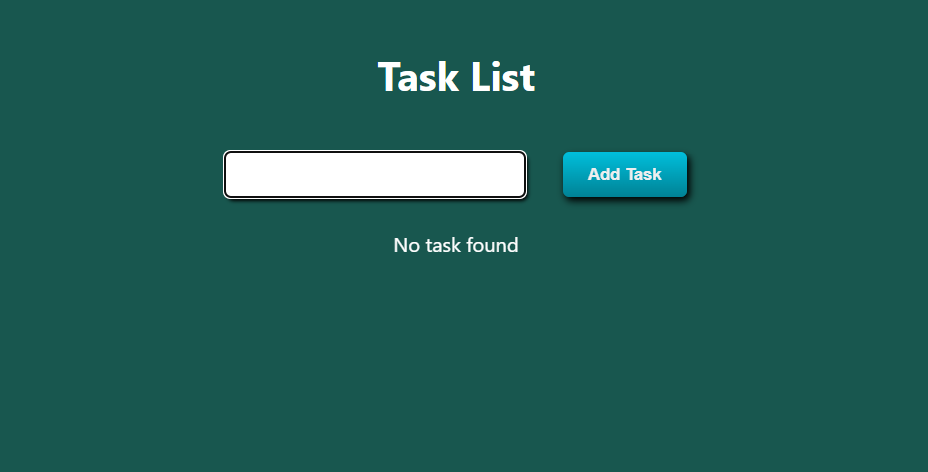
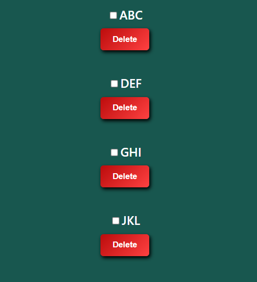
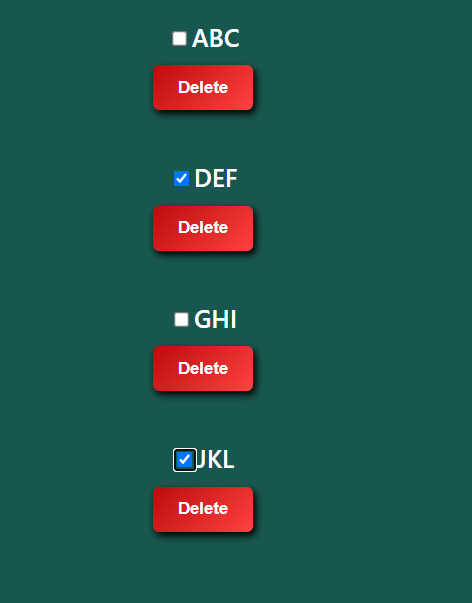

# A Task Manager with basic functionalities

This project was bootstrapped with [Create React App](https://github.com/facebook/create-react-app).

## How to Run

### 1. Download the repository.
### 2. Install node modules in the command line using `npm i`.
### 3. Use `npm start` in the root directory to start the application.

The app starts in the development mode.\
Open [http://localhost:3000](http://localhost:3000) to view it in your browser.

### 4. Add your tasks

### 5. Check-mark the tasks that are accomplished.

